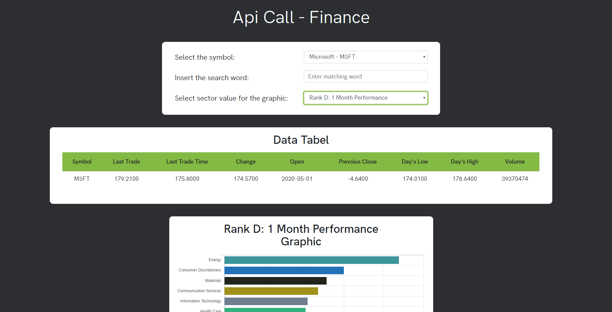

# Es12_Finance

#### Autore: Chopra Deepak

## Descrizione
> Un semplice esercizio in cui si effetuano delle api call per poter caricare i dati in tabella. Il sito utilizzato è l'Alpha Vantage. La pagina ha un header con una serie di filtri per la ricerca:
* combobox che permette di scegliere il 'symbol' di cui visualizzare i dati
* textbox in cui appena vengono inseriti almeno 2 caratteri, parte la api call che restituisce i dati in base al campo inserito
* combobox che permette di scegliere il rank di cui devono essere visualizzati i dati nel grafico
* button - SAVE CHART - permette di salvare il grafico come un image.jpg 
>  NB. L'immagine salvata se aperta con il programma foto predefinito di windows sembra      avere le scritte transaparenti, ma questo non capita con paint 
* button - UPLOAD CHART - permette di salvare il grafico su google drive mediante le api

## Problema - Risolto con Json Server!!!
>Alpha vantage, purtroppo, permette di effettuare solo 5 chiamte ajax al minuto ed 500 al giorno. Di conseguenza per la seconda parte dell'esercizio, l'applicazione va in errore avendo superato le call possibili. Quindi per evitare ciò vengono limitate le chiamate e vengono caricati solamente 3 entry nella tabella.

>Per ovviare a questo problema si è integrato node.js e installando json-server, si riesce a simulare il funzionamento di un Api call, quindi utilizzando esso si risolve il problema del limite delle chiamate

## Image figurativa

## Software neccesari:
* Jet Brains(PhpStorm, WebStorm)
* Git(per Windows o OS)
* Alpha Vantage(per le api call)
* Node.js(per json-server)
* Google Drive API(per la api key)

## Team work
> Invece si utilizza la piattaforma Github per poter lavorare anche da casa in gruppo senza alcun problema, visto che offre la possibiltà di creare repository condivise dove ciascuno può effettuare le modifiche necessarie. Il nostro è un utilizzo della piattaforma ancora superficiale, visto che abbiamo un repository ciascuno e siamo monitorari dal professore.

## Team sviluppatori:
> 4B Info - Vallauri Fossano Italy